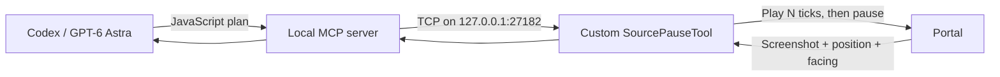

# Portal agent

This is the setup I used for my **GPT-6 Astra Portal run**, which reached the end credits on September 5, 2026 (San Francisco time, PDT / UTC−7).

**Portal pauses while the agent thinks.** The agent sees screenshots, player position, and camera angles, chooses its next inputs, then lets the game advance and checks the result.

The run used `gpt-6-astra` with `max` reasoning effort and took about **23 hours 43 minutes**, including capacity interruptions and waiting. I resumed it after capacity errors and switched to Fast mode. The agent handled gameplay throughout; after the initial goal, my only additional instruction was to leave the credits rolling.

## Explore or try it

- **[How it works](docs/how-it-works.md)** — what the agent saw and controlled.
- **[Run it yourself](docs/setup.md)** — the tested Windows setup.
- **[Read the session log](evidence/README.md)** — the agent's messages, actions, and results.

The controller and SourcePauseTool changes here are the versions used during the run. Game files are not included; you'll need your own copy of Portal.

Source files and technical reference

| Folder | Contents |
| --- | --- |
| `controller/` | Game controller, [API reference](controller/mcp/portal-documentation.md), and tests |
| `run/` | Agent instructions and configuration template |
| `game-config/` | Game settings and the SPT loader file |
| `spt/` | SourcePauseTool changes and [version details](spt/UPSTREAM.json) |
| `evidence/` | Sanitized session log and summary |
| `tools/` | Setup and export helpers |

## Credits and privacy

Controller code uses [MIT](controller/LICENSE); SourcePauseTool retains its [upstream license](spt/LICENSE) and [credits](spt/NOTICE). Portal belongs to Valve. Documentation and session evidence have no additional license grant.

Personal information and embedded screenshots were removed from the shared log. See [privacy notes](docs/publication.md).
